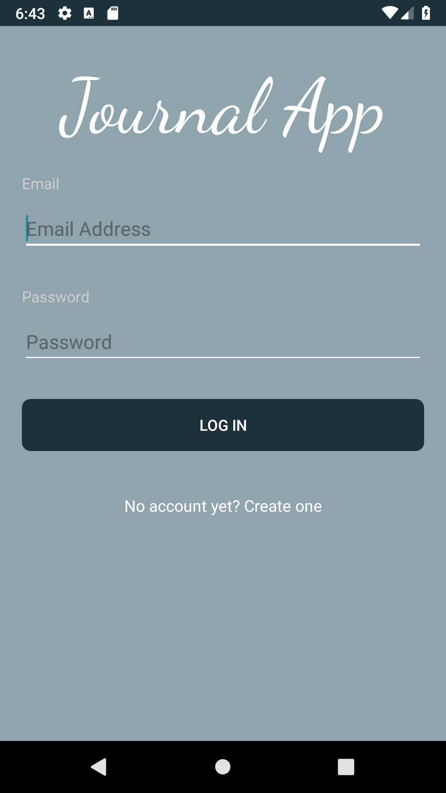
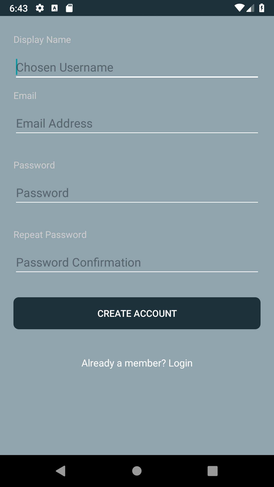
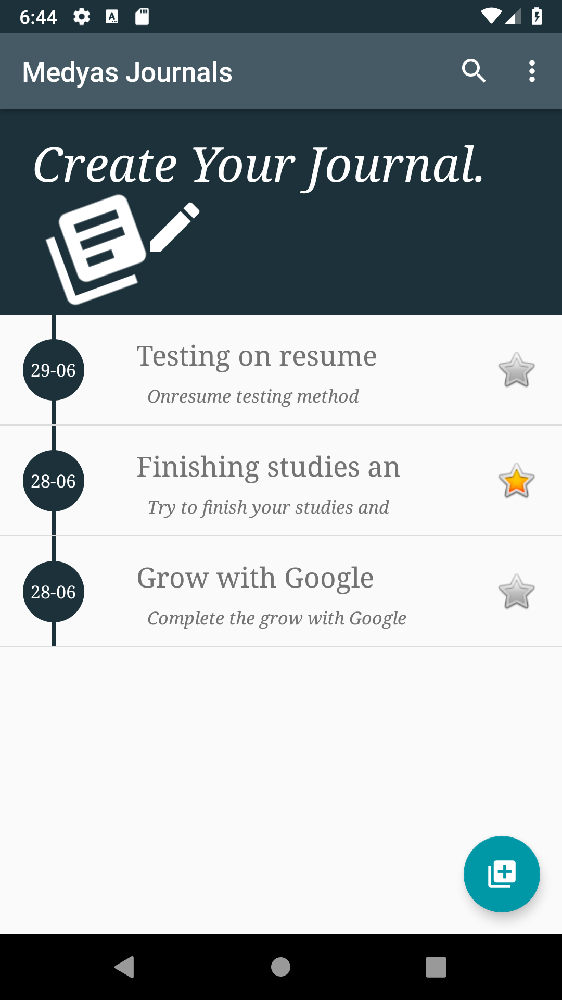
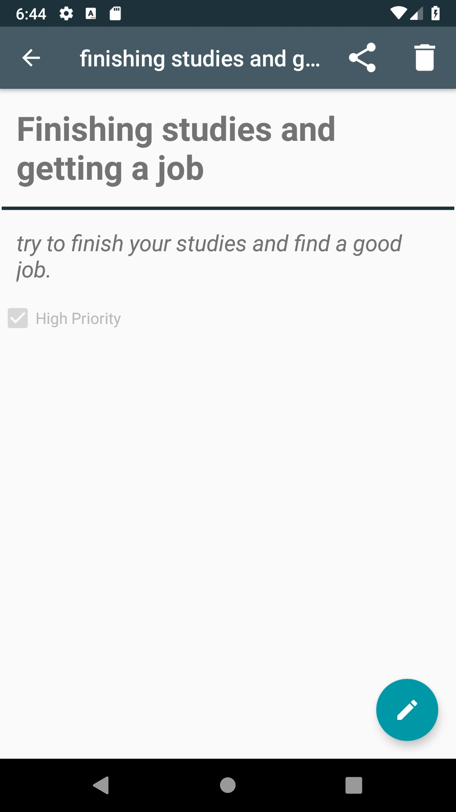

# Journal App - Google Africa Scholarship Program - ALC with Google

## This app is part of the Android Dev Track - Andela Learning Community (ALC) #7DaysofCodeChallenge
### Journal app allows users to pen down their thoughts and feelings. 
### Main Featuers:
- Register and Login using google authentication.
- View all entries to their diary.
- View the contents of a diary entry.
- Add and modify an entry.
- Also, This app uses Firebase Firestore database to store the data.

### To be Impelemented:
- Allow the app to work offline, using SQLite DB.
- Use background services to Sync between the DB and Firestore.

 [***Download APK***](static/JournalApp.apk)